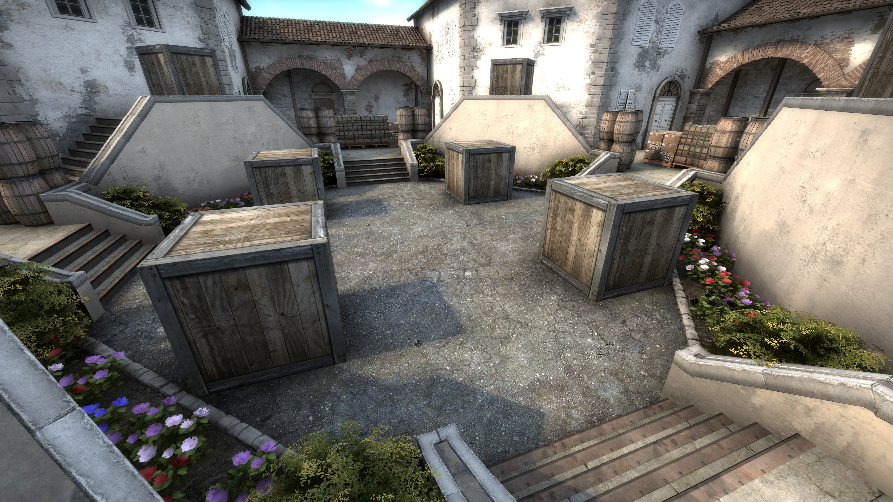

<h1 align="center" style="font-size: 55px">Areate</h1>

<div align="center" style="display:inline">
      
      
</div>
<div align="center" style="display:inline">
      
      
</div>

<div align="center" style="display:inline">
      
</div>

[](https://steamcommunity.com/sharedfiles/filedetails/?id=823181241)

## Scripts
```
📦vscripts
 ┣ 📜main.nut
 ┣ 📜globals.nut
 ┣ 📜vs_eventlistener.nut
 ┣ 📜vs_events.nut
 ┗ 📜vs_library.nut
 ```

### main.nut

The entry point, called from hammer with a `logic_script` entity.

- round_start
  - If it's round 0 the help menu will be printed
  - Bots are kicked each round unless enabled.
  - Iterate over every player and equip their weapons.
  - Players are instantiated and given a unique id.

- player_say:
  - Parses player input and executes the corresponding command.

### globals.nut

Holds the state of players, game options and available weapons.

### vs_eventlistener, vs_events & vs_library

Used for listening to in-game events.
The library can be found at [samisalreadytaken/vs_library](https://github.com/samisalreadytaken/vs_library).

## Map Entities

- logic_eventlistener
  - targetname: vs.eventlistener

- point_template
  - Entity Scripts: vs_eventlistener.nut
  - Template01: vs.eventlistener

These two entities are used to capture in-game events such as: player_spawn, player_say, round_start.

- logic_script
  - Entity Scripts: main.nut

Executes main.nut.

- move_rope
  - Entity Scripts: globals.nut

For some reason, variables in main.nut are reset every round. For some reason scripts in move rope are persistent but never changed.

- game_player_equip
  - Name: equip_strip

Used to remove weapons from players.

## Commands


| Command     | Function                                                           | Parameters                                 | Example    |
|-------------|--------------------------------------------------------------------|--------------------------------------------|------------|
| weapon/w    | Gives the player any weapon. `!w` will list all available weapons. | [Any weapon name.](vscripts/main.nut#L313) | !w m4a4    |
| random/r    | Randomizes the weapons given.                                      | Primary, Secondary, Knife, Competitive.    | !r primary |
| armour/a    | Toggles kevlar.                                                    |                                            | !a         |
| helmet/helm | Toggles helmets.                                                   |                                            | !helm      |
| headshot/hs | Toggles headshot only.                                             |                                            | !hs        |
| bumpmines/b | Gives bumpmines at the start of the round.                         |                                            | !b         |
| bot         | Toggles bots.                                                      |                                            | !bot       |
| help/h      | Displays a list of every command.                                  |                                            | !h         |
| reset       | Legacy command to fix userid errors.                               |                                            | !reset     |

Command abbreviations can be found [here](vscripts/main.nut#L96).
