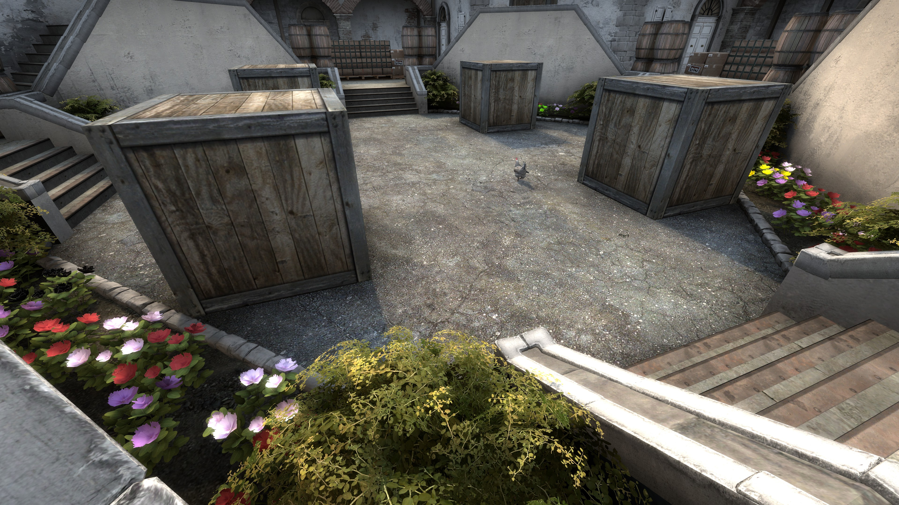

<h1 align="center" style="font-size: 55px">Areate</h1>

<div align="center" style="display:inline">
      
      
</div>
<div align="center" style="display:inline">
      
      
</div>

<div align="center" style="display:inline">
      
</div>

I need to take some new screenshots with the new skybox, old ones look a bit drab.

## Scripts
```
📦vscripts
 ┣ 📜main.nut
 ┣ 📜globals.nut
 ┣ 📜vs_eventlistener.nut
 ┣ 📜vs_events.nut
 ┗ 📜vs_library.nut
 ```

### main.nut

Called from hammer with a `logic_script` entity.

Entry point which handles most of the logic.

**round_start:**
  - If it's round 0 the help menu is printed
  - Bots will be kicked each round if they're not enabled.
  - Iterate over every player and give them their weapons.
  - A new player class will be created if their id hasn't been assigned to one.

**player_say:**
  - Parses the players input and executes the corresponding commands

### globals.nut

Holds the state of players, game options and available weapons.

### vs_eventlistener, vs_events & vs_library

Used for listening to in-game events.
The library can be found at [samisalreadytaken/vs_library](https://github.com/samisalreadytaken/vs_library).

## Map Entities
**logic_eventlistener**:
- targetname: vs.eventlistener

**point_template**:
- Entity Scripts: vs_eventlistener.nut
- Template01: vs.eventlistener

*These two entities are used to capture in-game events such as: player_spawn, player_say, round_start.*

**logic_script**:
- Entity Scripts: main.nut

*Executes main.nut.*

**move_rope**:
- Entity Scripts: globals.nut

*For some reason, variables in main.nut are reset every round. For some reason scripts in move rope are persistent but never changed.*

**game_player_equip**:
- Name: equip_strip

*Used to remove weapons from players. There might be a better way to do this.*

## Commands

>❗ All chat commands start with an exclamation mark.

> Commands have many abbreviations, you can find them [here](vscripts/main.nut#L96).

| Command     | Function                                  | Parameters                             | Example    |
|-------------|-------------------------------------------|----------------------------------------|------------|
| weapon/w    | Gives the player any weapon               | [Weapon Name](vscripts/main.nut#L313)  | !w m4a4    |
| random/r    | Randomizes the weapons given              | Primary, Secondary, Knife, Competitive | !r primary |
| armor/a     | Toggles kevlar                            |                                        |            |
| helmet/helm | Toggles helmets                           |                                        |            |
| headshot/hs | Toggles headshot only                     |                                        |            |
| bumpmines/b | Gives bumpmines at the start of the round |                                        |            |
| bot         | Toggles bots                              |                                        |            |
| reset       | Legacy command to fix userid errors       |                                        |            |